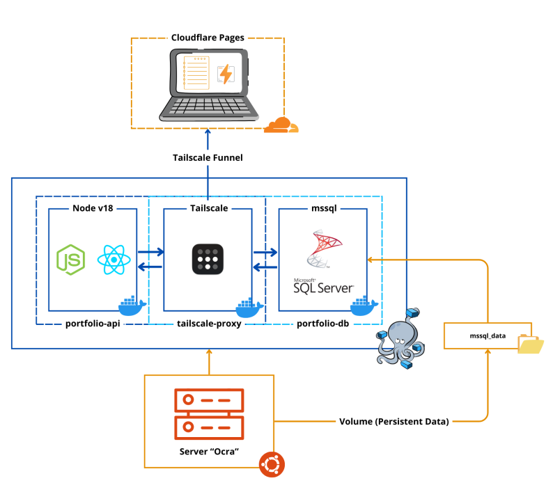
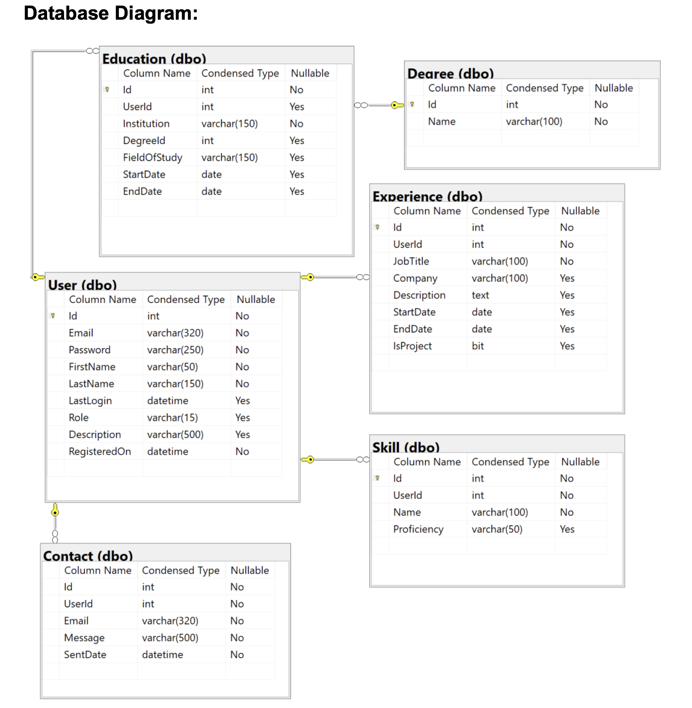

# Web Portfolio Node

The project consists of two applications: the front-end and the REST API, which handles authentication and calls and requests.

Check the other directories for the separate README for each program.

### Architecture Diagram:

### Entity Relationship Diagram:

